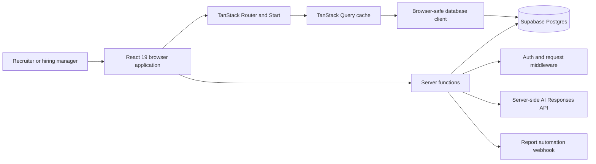
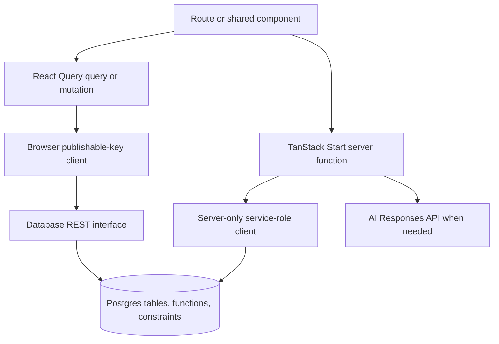
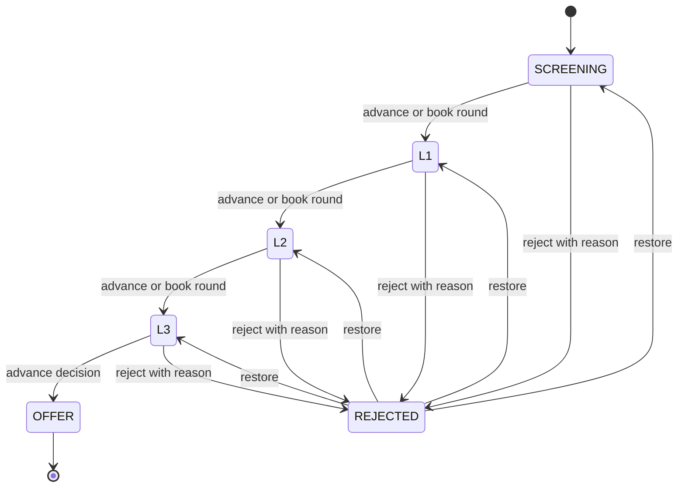
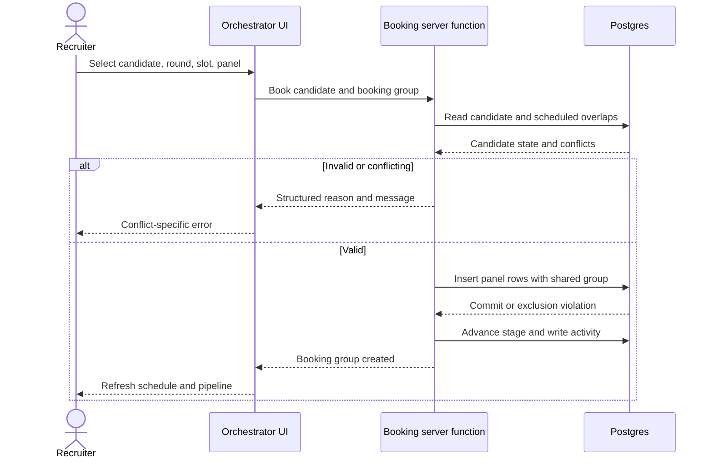
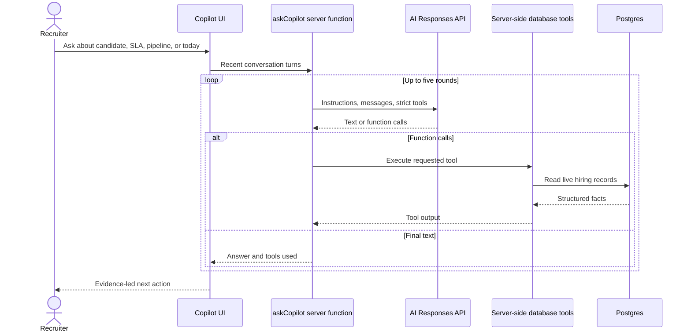
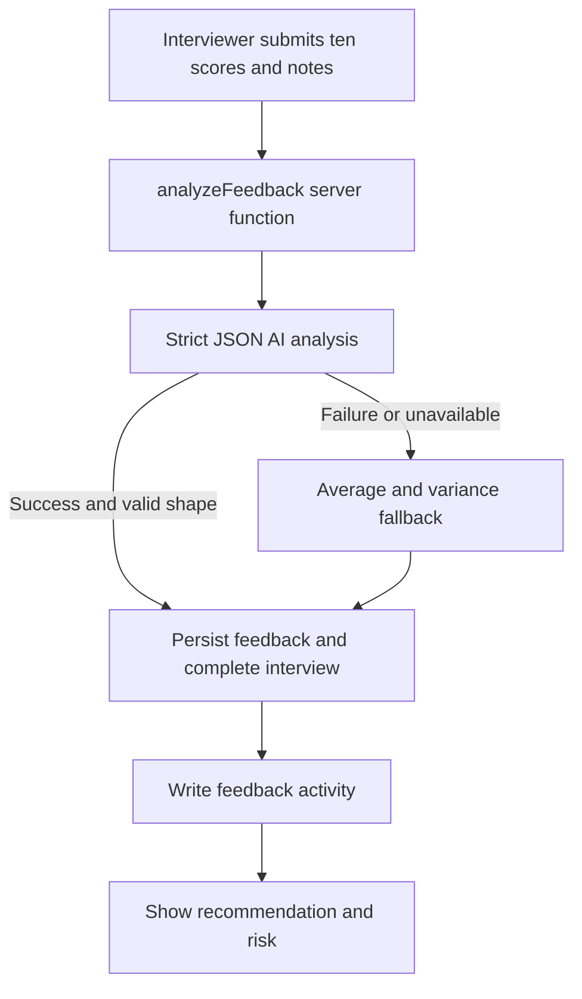
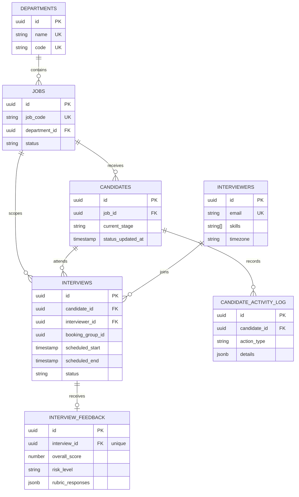
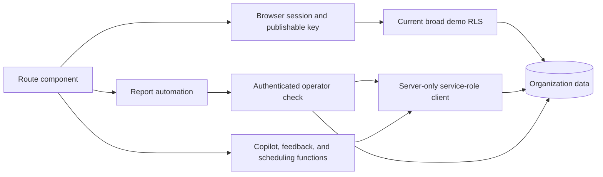
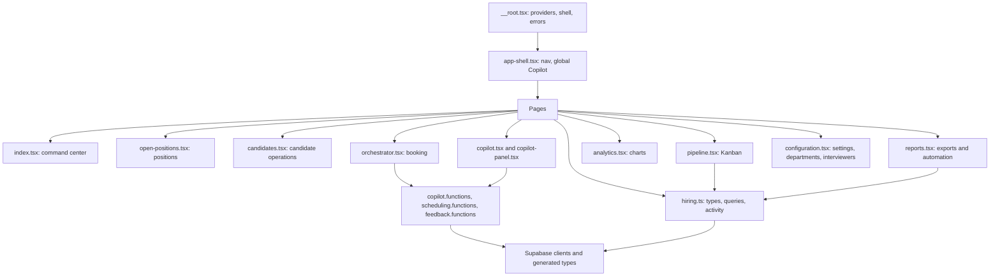

# HireCopilot: Product and System Understanding

HireCopilot is a hiring-operations command center for teams that need to move candidates through a process without losing operational context. It unifies pipeline status, interview coordination, structured feedback, risk signals, reporting, and explainable AI assistance in one workspace.

The product thesis is simple: fragmented status tracking, scheduling coordination, and inconsistent feedback slow hiring. HireCopilot makes the operational state visible and actionable while keeping hiring decisions with people. Its AI can retrieve live facts, surface risk, and recommend the next action; it does not replace recruiter or interviewer judgment.

## What Judges Should See

- A live executive view of open positions, interviews today, offers, high-risk candidates, hiring-cycle timing, SLA breaches, and the next work to do.
- A six-stage candidate pipeline: Screening, L1, L2, L3 / Leadership, Offer, and Rejected.
- Candidate and position operations with search, filters, details, activity history, create/edit/delete, rejection, and restoration flows.
- An interview orchestrator that chooses a candidate and round, proposes local working-hour slots, ranks panel members by skill overlap and workload, validates conflicts, books safely, and can reschedule or cancel.
- A full-page Copilot and a global slide-over Copilot that answer operational questions from live database tools.
- A ten-question feedback rubric that persists scores and notes, produces AI risk analysis, and falls back to deterministic scoring when AI is unavailable.
- Analytics, CSV reporting, and optional authenticated scheduled report automation.

## Architecture At A Glance

The application is a full-stack TypeScript project using React 19, TanStack Start, TanStack Router, TanStack Query, Supabase/Postgres, Tailwind CSS, Radix-based shadcn-style primitives, Recharts, Zod, and Lucide icons. There is no separate global client store: TanStack Query owns server state and React hooks own transient UI state.

## Executive Command Center

The root route (`/`) is the executive hiring command center. It loads candidates, interviews, positions, feedback, and activity through shared query definitions. Its KPIs include:

- Open positions and positions opened this month.
- Interviews scheduled today.
- Offers recorded today from activity transitions.
- High-risk active candidates from persisted feedback.
- Average hiring cycle from candidate activity.

The AI Priority Center identifies active candidates beyond the three-day stage SLA, shows stage age and role, and links directly to scheduling. Today's interview list and a stage funnel make the operational state scannable. Loading states use skeletons; query errors show `Unavailable`; empty states explain that there is no work scheduled or no breach to address.

Some dashboard values are intentionally resilient demo behavior: when source data is empty, certain legacy KPI surfaces use fallback display values, while current query errors are represented as unavailable. Judges should treat the live records and explicit error state as the source of truth.

## Candidate Pipeline

The `/pipeline` route presents six Kanban stages:

1. Screening
2. L1 Technical
3. L2 Technical
4. L3 / Leadership
5. Offer
6. Rejected

Each active card shows role, stage age, and SLA classification. Up to three days is on track, four to five days is warning, and six or more days is breach. Cards link into the orchestrator and can open feedback when an interview exists.

The `/candidates` route adds operational depth: text search, advanced filters, sorting, selected-candidate detail, job and contact data, skills, interview context, rejection reason, and activity history. Candidate CRUD validates input, updates `status_updated_at`, and logs application or stage activity. Rejection requires a reason, persists it, moves the candidate to `REJECTED`, and records the transition. Restoration clears the reason, returns the candidate to a chosen non-rejected stage, updates the timestamp, and logs the transition. Deletion removes dependent feedback, interviews, and activity before removing the candidate.

## Positions and Departments

`/open-positions` supports position search, status and department filters, details, linked candidates, interview context, create/edit, close/reopen, and guarded deletion. `/configuration` manages departments and interviewers in addition to local SLA and automation controls.

Departments have unique names and two-to-six-character uppercase alphanumeric codes. Creating a position calls the database `create_job_with_code` function, which generates a unique code from the year sequence and department code. Editing preserves the existing code. A position or department cannot be deleted while dependent records still reference it.

## Interview Orchestrator

The `/orchestrator` route is a guided booking workflow:

1. Choose a candidate and round.
2. Find a slot.
3. Select a panel.
4. Confirm and book.
5. Log the reminder step.

Candidate selection excludes rejected and offered candidates by default. Round progression is derived from existing interviews rather than only from the current stage. The panel ranking combines candidate/interviewer skill overlap with scheduled interviewer load. Slot suggestions use weekday business hours and a lead-time buffer. A manual date and time can be selected when a suggested local slot is not suitable.

Booking is a server function. It checks that a panel exists, the slot is in the future, the candidate exists and is not rejected, and neither the candidate nor selected interviewers have an overlapping scheduled interview. It creates one `booking_group_id` for all panel rows, advances the candidate stage, updates the stage timestamp, and writes activity entries. Rescheduling cancels the previous group only after scoped validation and restores it if insertion fails. Cancellation is scoped by candidate and booking group, requires a reason, changes scheduled rows to cancelled, and logs the action.

Two defenses protect schedule integrity: application-level overlap checks and Postgres GiST exclusion constraints. The database enforces valid time ranges, permitted statuses, no candidate overlap across booking groups, and no interviewer overlap for scheduled rows.

The orchestrator's confirmation and UI language may imply calendar or Teams/email delivery, but the current implementation records a reminder activity event only; no external notification is sent. Local slot generation is also a deliberate prototype boundary rather than a connected calendar integration.

## Copilot

The `/copilot` route and the global launcher in `AppShell` use the same `CopilotChat` component. Conversation state stays in the component, the most recent twelve turns are sent to `askCopilot`, and the UI displays loading, error, markdown-like responses, and tool badges.

The server function exposes four strict tools:

- `getCandidateStatus`: stage, days in stage, role, interviews, and recent activity.
- `getStuckCandidates`: active candidates beyond a requested SLA threshold.
- `getPipelineSummary`: stage counts, open positions, interviews today, and blocked positions.
- `getTodaysInterviews`: today's scheduled candidates, interviewers, rounds, and times.

The bounded loop runs for at most five tool-call rounds. Each tool request is executed server-side with the service-role client, its result is returned to the model, and the final response includes the tool names used. The system instruction requires live data, concise evidence, explicit SLA flags, and a recommended next action.

## Feedback and Risk

`FeedbackModal` presents ten 1-to-10 rubric sliders covering technical depth, data modelling, system design, quality, debugging, integration, operations, ownership, communication, and collaboration. It calculates a live average and projected risk before submission, accepts written notes, and persists one feedback record per interview.

`analyzeFeedback` runs server-side AI analysis with a strict JSON schema containing overall score, risk level, rationale, recommendation, sentiment, strengths, and concerns. A hard score rule keeps very low scores high risk. If the AI call fails, deterministic analysis uses average and variance thresholds to produce a score, risk, recommendation, rationale, and local-computation label.

After analysis, the browser-safe mutation writes `interview_feedback`, marks the booking group completed, logs `FEEDBACK_SUBMITTED`, invalidates interviews, feedback, and activity queries, and reports the outcome. A unique database constraint and a specific duplicate-feedback response prevent accidental second submissions.

## Analytics and Reports

`/analytics` visualizes the hiring funnel, sources, and throughput using Recharts and query data. `/reports` provides SLA-breach and interview activity views plus direct CSV export. The report route also supports an optional automated reporting path:

- Daily interview activity and open-position reports.
- Daily or weekly open-position schedules.
- Recipient normalization and time validation.
- Authenticated operator checks before schedule, cancel, or send-now actions.
- Test sends, status checks, cancellation, and clear error messages for missing configuration or rejected requests.

The external delivery path is configured through server environment variables and a private webhook secret. Local browser storage is only a UI cache for open-position schedule presentation; the server-side trigger remains authoritative. Direct CSV download works independently of automated delivery.

## Data Model

The database contains seven primary tables:

- `departments`: unique name and code.
- `jobs`: title, generated job code, department, location, skills, dates, and status.
- `interviewers`: identity, title, skills, and time zone.
- `candidates`: identity, job, source, experience, skills, stage, stage timestamp, and rejection reason.
- `interviews`: candidate, job, interviewer, round, time range, booking group, meeting link, and status.
- `interview_feedback`: one feedback record per interview with rubric JSON, decision, score, risk, and rationale.
- `candidate_activity_log`: append-style operational history with JSON details.

## Client, Server, and Security Boundaries

Browser code imports only the publishable Supabase client. It uses TanStack Query for reads and direct browser-safe mutations, followed by targeted query invalidation. The service-role client is dynamically imported only inside server functions and bypasses row-level policies, so it must never enter browser code.

Server functions own privileged or consistency-sensitive work: Copilot tool reads, AI calls, feedback analysis, interview booking, rescheduling, and cancellation. Report automation has explicit authenticated operator checks. The current Copilot, feedback, and scheduling server functions use server-only privileged access without equivalent end-user authentication enforcement in this prototype. Start middleware and server error handling provide CSRF protection and normalize server/SSR failures. The root route supplies not-found and render-error boundaries.

The current prototype RLS policies are intentionally broad for demo data: anonymous and authenticated roles have CRUD access to the core tables. That is a known security caveat, not a production authorization model. Production hardening requires real identity, organization and recruiter membership, organization-scoped policies, least-privilege server access, audit ownership, rate limits, and stronger validation of every tool input.

## Validation Snapshot

- `npm run build` passes with deprecation and bundle-size warnings.
- `npm run lint` currently fails with 269 problems; lint does not pass.
- No dedicated automated test script exists.
- Mermaid CLI validation was not available; the diagrams were checked for balanced fenced blocks.

## Route and Module Architecture

Routes are direct children of the root route. Shared domain queries and helpers live in `src/lib/hiring.ts`; server functions live in focused `*.functions.ts` modules; shared UI and dialogs live in `src/components`.

## Capability Matrix

| Capability | Status | Evidence and boundary |
|---|---|---|
| Executive KPIs and priority center | **Implemented** | Live queries, SLA computation, loading/error/empty states; selected dashboard fallbacks remain demo behavior. |
| Six-stage candidate pipeline | **Implemented** | Kanban, stage age, SLA buckets, deep links, rejection and restoration. |
| Candidate CRUD and activity | **Implemented** | Zod-backed forms, detail/activity view, dependent deletion and invalidation. |
| Positions and departments | **Implemented** | Lifecycle actions, generated codes, dependency guards, persisted departments. |
| Interview panel ranking | **Implemented** | Skill overlap and workload ranking in the orchestrator. |
| Calendar slot discovery | **Simulated / Demo-only** | Local weekday/business-hour slot generation; no external calendar source. |
| Conflict-safe booking | **Implemented** | Server validation plus database overlap constraints and race handling. |
| Reschedule and cancellation | **Implemented** | Scoped booking groups, rollback on failed rebooking, required cancellation reason. |
| Reminder delivery | **Simulated / Demo-only** | Reminder action logs activity; it does not deliver messages. |
| Copilot live retrieval | **Implemented** | Four strict tools, server-side reads, bounded five-round loop, tool badges. |
| AI feedback risk analysis | **Implemented** | Strict JSON response shape with deterministic fallback. |
| Feedback persistence and completion | **Implemented** | Unique interview feedback, status update, activity log, targeted invalidation. |
| Analytics and CSV | **Implemented** | Recharts views and browser CSV export. |
| Scheduled report delivery | **Implemented with setup dependency** | Authenticated schedule/status/send/cancel path; requires configured server webhook and operator. |
| SLA and automation settings | **Simulated / Demo-only** | Threshold and toggles are local UI state. |
| Organization authorization | **Future / Production hardening** | Current demo RLS is broad and not organization-scoped. |
| Automated test suite | **Future / Production hardening** | No dedicated test script is listed in `package.json`. |

## Error, Loading, Empty, and Fallback Behavior

- Queries render skeletons while loading and explicit unavailable states when a source errors.
- Empty dashboards explain that no interviews or SLA breaches exist instead of presenting blank panels.
- Booking returns structured reasons for missing panels, past slots, rejected candidates, candidate conflicts, interviewer conflicts, invalid ranges, and race conditions.
- Copilot reports database or AI errors in the conversation and caps tool execution at five rounds.
- Feedback always has a deterministic path based on average and variance if AI is unavailable, and marks whether the result was AI-generated.
- Report configuration validates recipients, dates, times, report types, operator identity, endpoint shape, and webhook secret requirements.
- Root and server boundaries normalize render, SSR, and request failures into user-visible error surfaces.

## Prototype Boundaries and Future Hardening

This is a focused, demo-ready prototype rather than a complete hiring platform. The product proves the operational loop from pipeline visibility to booking to feedback and action recommendation. Its boundaries are explicit:

- Dashboard fallbacks are not a substitute for a warehouse-grade KPI aggregation layer.
- Local slots are not calendar availability, time-zone negotiation, or working-hours policy enforcement across organizations.
- Reminder logging is not notification delivery.
- SLA and automation settings are not persisted organization policy.
- Broad demo policies do not isolate organizations or users.
- AI output is assistive and must remain explainable, bounded, validated, and reviewable by humans.

The production path should add organization-scoped schema and RLS, role-based permissions, calendar and notification adapters, persisted settings, transactional booking and activity semantics, durable report schedules, observability, rate limiting, prompt and tool audit logs, data retention controls, privacy review, automated unit/integration/e2e tests, and a reliable aggregate reporting model.

## Concise Judge Demo Journey

1. Start on the command center and identify a candidate beyond the three-day SLA.
2. Open the candidate or follow the schedule action into the orchestrator.
3. Select the next round, accept a ranked local slot and panel, and show a successful booking.
4. Attempt an overlapping slot to demonstrate a conflict-specific rejection, then choose a valid slot.
5. Use the global Copilot to ask who is stuck, what interviews are today, or which positions are blocked; point out the live-tool badges.
6. Open feedback for a completed interview, score the ten criteria, add notes, and show the risk recommendation.
7. Finish in Analytics or Reports with the funnel, SLA list, CSV export, and optional report schedule controls.

The story is visible end to end: one operational source of truth, safe workflow automation, evidence-led AI assistance, and human-controlled hiring decisions.